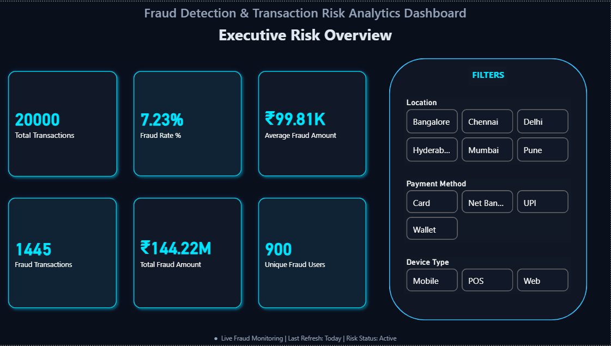
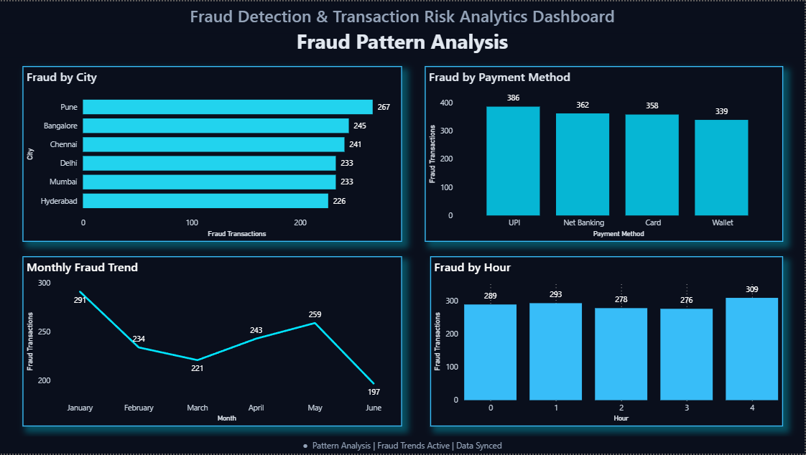
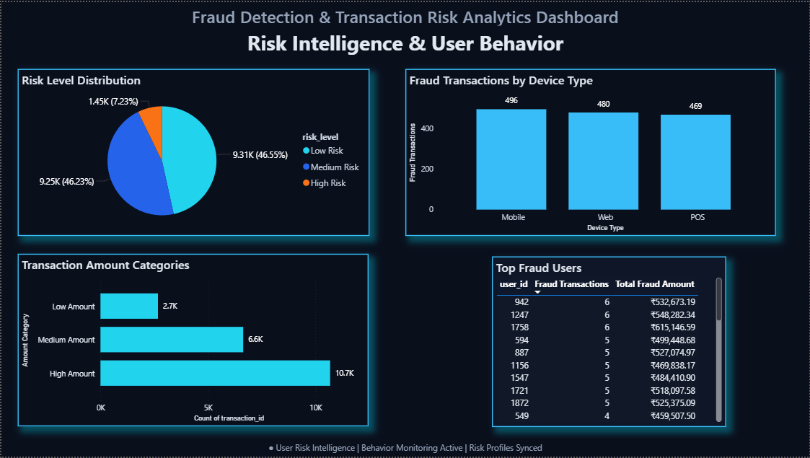

# Fraud Detection & Transaction Risk Analytics Dashboard

## Project Overview

Fraud Detection & Transaction Risk Analytics Dashboard is a Business Intelligence project developed using SQL and Power BI to analyze financial transaction data and identify fraudulent activities through interactive dashboards.

The project focuses on transforming raw transaction data into meaningful business insights by analyzing fraud patterns, monitoring transaction risks, and visualizing key performance indicators (KPIs). The dashboard enables stakeholders to explore fraud trends, identify high-risk transactions, and support data-driven decision-making.

---

## Problem Statement

Financial institutions process thousands of transactions every day, making it difficult to manually detect fraudulent activities. Delayed detection can lead to significant financial losses and increased operational risks.

This project aims to analyze transaction data, identify suspicious patterns, monitor fraud-related KPIs, and provide an interactive dashboard that helps organizations quickly detect fraud trends and make informed decisions.

---

## Objectives

- Analyze financial transaction data using SQL.
- Monitor fraud-related KPIs through interactive dashboards.
- Identify fraud hotspots based on transaction locations.
- Compare fraud across different payment methods.
- Analyze fraud distribution by device type.
- Study fraud trends over time.
- Categorize transactions into different risk levels.
- Identify high-risk users involved in fraudulent transactions.
- Build an interactive dashboard for business users.

---

## Dataset Information

The dataset consists of simulated financial transaction records created for fraud analysis.

## Dataset Generation

To simulate a real-world fraud detection scenario, the dataset was generated programmatically using Python. Randomized transaction records were created with realistic attributes such as transaction amount, payment method, device type, location, transaction time, and fraud status. Additional fields including risk level, transaction hour, and amount category were derived to support advanced SQL analysis and interactive Power BI visualizations.

### Dataset includes:

- Transaction ID
- User ID
- Transaction Amount
- Transaction Date & Time
- Merchant Category
- Transaction Location
- Device Type
- Payment Method
- Failed Login Attempts
- Fraud Status
- Transaction Hour
- Risk Level
- Amount Category

**Total Records:** 20,000+

---

## Tools and Technologies Used

- SQL (PostgreSQL)
- Power BI
- Python (Dataset Generation & Preprocessing)
- Pandas
- NumPy
- Git
- GitHub

---

## Project Workflow

1. Dataset Generation
2. Data Cleaning & Preprocessing
3. SQL Data Analysis
4. KPI Development
5. Dashboard Design in Power BI
6. Business Insights Extraction

---

## Dashboard Pages

### Executive Risk Overview

- Total Transactions
- Fraud Transactions
- Fraud Rate (%)
- Average Fraud Amount
- Total Fraud Amount
- Unique Fraud Users
- Interactive Filters (Location, Payment Method, Device Type)

### Fraud Pattern Analysis

- Fraud Hotspots by City
- Fraud by Payment Method
- Monthly Fraud Trend
- Fraud by Transaction Hour

### Risk Intelligence & User Behavior

- Risk Level Distribution
- Fraud by Device Type
- Transaction Amount Categories
- Top Fraud Users

---

## Key Insights

- Identified cities with the highest fraudulent transaction activity.
- UPI transactions recorded the highest number of fraud cases.
- Mobile devices contributed to the largest share of fraudulent transactions.
- Fraud activity varied significantly across different hours of the day.
- High-risk transactions accounted for a small portion of total transactions but represented significant financial exposure.
- Interactive filters enable detailed analysis by location, payment method, and device type.

---

## Dashboard Preview

### Executive Risk Overview

---

### Fraud Pattern Analysis

---

### Risk Intelligence & User Behavior

---

## Repository Contents

- `datasets/` → Transaction dataset used for analysis.
- `sql/` → SQL scripts for database creation and analysis.
- `dashboard/` → Power BI dashboard (.pbix).
- `images/` → Dashboard screenshots.
- `README.md` → Project documentation.

---

## Conclusion

This project demonstrates how SQL and Power BI can be combined to analyze financial transaction data and uncover fraud patterns. The interactive dashboard enables users to monitor fraud metrics, identify transaction risks, and derive meaningful business insights that support better decision-making.

---

## Author

**Nikhil Makare**  
Aspiring Data Analyst focused on Data Cleaning, EDA, Visualization, and Business Insights